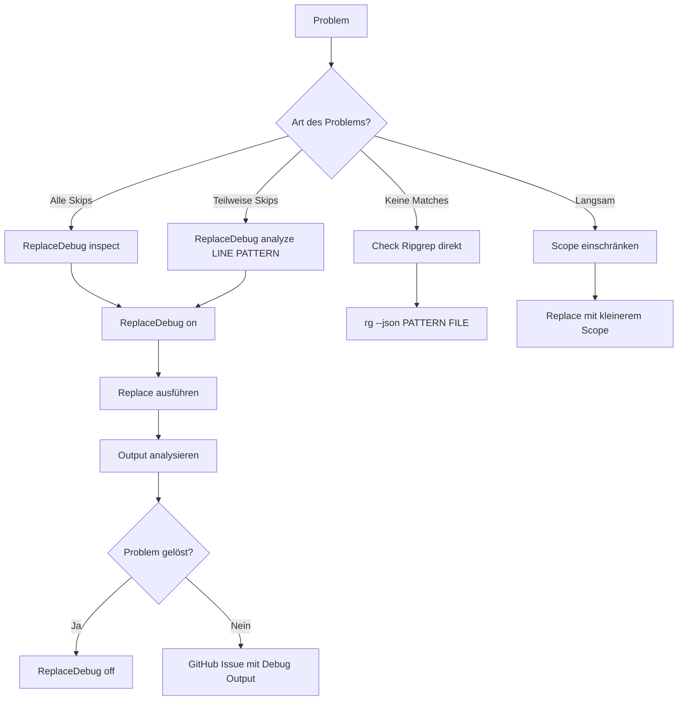

# Replacer Debug Guide

## Quick Diagnosis

### Szenario 1: "Alle Matches werden übersprungen"

```vim
" Symptom:
[replacer] skip changed spot: file.lua:45:5
[replacer] skip changed spot: file.lua:42:5
[replacer] 0 spot(s) in 1 file(s)

" Diagnose:
:ReplaceDebug on
:ReplaceDebug inspect
:Replace "your-pattern" "new-text" %

" Häufige Ursachen:
" 1. Datei wurde zwischenzeitlich geändert
" 2. UTF-8 Encoding-Problem
" 3. Ripgrep findet Pattern, aber Offsets stimmen nicht
```

**Lösung:**
```lua
-- In setup(), temporär aktivieren:
ext_highlight_opts = {
  debug = true,  -- Zeigt hex dumps
}
```

---

### Szenario 2: "Nur erste Occurrence wird gefunden"

```vim
" Symptom:
" Zeile hat "test test test", aber nur 1 Match im Picker

" Diagnose:
:ReplaceDebug analyze 45 "test"
```

**Erwartete Ausgabe:**
```
=== Analyzing line 45 ===
Pattern: 'test'
Line: 'test test test'
Byte length: 14
Char length: 14

Occurrences:
  #1: bytes [0:3] chars [0:4] text='test'
  #2: bytes [5:8] chars [5:9] text='test'
  #3: bytes [10:13] chars [10:14] text='test'
```

**Wenn nur 1 Occurrence angezeigt wird:**
→ Ripgrep liefert unvollständige Submatches
→ Fixed: Fallback-Scan in `rg.lua` aktiviert

---

### Szenario 3: "UTF-8 Zeichen (Umlaute, Emoji) falsch"

```vim
" Symptom:
:Replace "Müller" "Mueller" %
[replacer] skip (mismatch): expected 'Müller', got 'M?ller'

" Oder:
[replacer] skip (out of range): s=15 e=19 len=18
```

**Diagnose:**
```vim
:ReplaceDebug analyze 45 "Müller"
```

**Erwartete Ausgabe (korrekt):**
```
Occurrences:
  #1: bytes [0:6] chars [0:6] text='Müller'
       ^ ü = 2 bytes (C3 BC)
```

**Wenn bytes/chars nicht passen:**
→ File Encoding prüfen: `:set fileencoding?`
→ Sollte `utf-8` sein

**Fix:**
```vim
:set fileencoding=utf-8
:w
:Replace "Müller" "Mueller" %
```

---

### Szenario 4: "Pattern funktioniert in ripgrep, aber nicht im Plugin"

```bash
# Terminal: funktioniert
$ rg --json "test" file.lua
{"type":"match","data":{...}}

# Plugin: findet nichts
:Replace "test" "new" %
[replacer] no matches found
```

**Diagnose:**
```vim
:ReplaceDebug on
:Replace "test" "new" %
```

**Mögliche Ausgaben:**

**Fall A: Ripgrep Fehler**
```
[replacer] rg failed: <error message>
```
→ Check ripgrep args in Config

**Fall B: JSON Parse Error**
```
" Nichts in debug output
```
→ Ripgrep gibt kein valides JSON zurück
→ Check: `rg --version` (min. 11.0)

**Fall C: Submatches leer**
```
[replacer] Found 0 match(es)
```
→ Ripgrep findet matches, aber submatches array ist leer
→ Fallback-Scan sollte aktivieren (bereits in Fix)

---

### Szenario 5: "Replacement funktioniert, aber wird nicht gespeichert"

```vim
:Replace "old" "new" %
[replacer] 5 spot(s) in 1 file(s)

" Aber Datei ist unverändert
```

**Check Config:**
```lua
require("replacer").setup({
  write_changes = true,  -- Muss true sein!
})
```

**Oder manuell speichern:**
```vim
:w
```

---

### Szenario 6: "Performance: Replacement dauert ewig"

```vim
" Bei großen Dateien (>10k Zeilen)
:Replace "common-word" "new" cwd
" ... hängt ...
```

**Diagnose:**
```vim
:ReplaceDebug inspect
" Check: line_count

" Wenn > 10.000:
```

**Optimization:**
```lua
-- Scope einschränken
:Replace "word" "new" %  -- nur aktueller buffer
:Replace "word" "new" src/  -- nur src/ directory
```

**Oder Ripgrep Optionen:**
```lua
require("replacer").setup({
  exclude_git_dir = true,  -- Skip .git/
  git_ignore = true,  -- Respect .gitignore
})
```

---

## Test-Suite Interpretieren

```vim
:ReplaceDebug test
```

**Alle Tests pass:**
```
✓ ASCII baseline
✓ UTF-8 offsets
✓ Match validation
✓ Emoji offsets
✓ Ripgrep submatch simulation
✓ Line normalization

=== Results: 6 passed, 0 failed ===
```
→ **Plugin funktioniert korrekt**

**Test Failure:**
```
✗ UTF-8 offsets FAILED: assertion failed
```
→ **Neovim/Lua UTF-8 Support Problem**
→ Check Neovim Version (min. 0.9)

---

## Mismatch Hex Dump verstehen

```vim
:ReplaceDebug on
:Replace "Müller" "Mueller" %

[replacer] skip (mismatch): file.lua:45:5
  expected: 'Müller' [4D C3 BC 6C 6C 65 72]
  actual:   'Muller' [4D 75 6C 6C 65 72]
```

**Interpretation:**
```
'Müller'
 M  ü  l  l  e  r
 4D C3BC 6C 6C 65 72  (Bytes)
    ^^^^
    ü = C3 BC (2 bytes UTF-8)

'Muller'
 M  u  l  l  e  r
 4D 75 6C 6C 65 72
    ^^
    u = 75 (1 byte ASCII)
```

**Bedeutung:**
- Datei hat "Muller" (ohne Umlaut)
- Du suchst "Müller" (mit Umlaut)
→ **Pattern passt nicht**

**Fix:**
```vim
" Entweder:
:Replace "Muller" "Mueller" %  " Ohne Umlaut suchen

" Oder Datei korrigieren:
:%s/Muller/Müller/g
:w
:Replace "Müller" "Mueller" %
```

---

## Common Pitfalls

### 1. Literal vs Regex Mode

```lua
-- Default: Literal (fixed-strings)
:Replace "test.*" "new" %
" Findet: "test.*" (literal dot-star)

-- Regex Mode:
require("replacer").setup({
  literal = false,
})
:Replace "test.*" "new" %
" Findet: "test" + beliebige chars
```

### 2. Smart Case

```lua
-- Mit smart_case = true (default):
:Replace "Test" "new" %
" Findet: "Test", "TEST", "test"

:Replace "test" "new" %
" Findet nur: "test" (all lowercase)
```

### 3. Scope Confusion

```vim
" Aktueller Buffer:
:Replace "old" "new" %

" Current Working Directory:
:Replace "old" "new" cwd

" Spezifischer Path:
:Replace "old" "new" /path/to/project

" NICHT verwechseln mit:
:Replace "old" "new"  " → default ist cwd!
```

---

## Debug-Modus Best Practices

1. **Nur temporär aktivieren** (Verbose Output!)
   ```vim
   :ReplaceDebug on
   " ... debug session ...
   :ReplaceDebug off
   ```

2. **Inspect vor Replace** (Check Buffer State)
   ```vim
   :ReplaceDebug inspect
   :Replace "pattern" "new" %
   ```

3. **Analyze bei Mismatches** (Understand Offsets)
   ```vim
   " Bei skip warnings:
   :ReplaceDebug analyze <line> "<pattern>"
   ```

4. **Test vor großen Replacements**
   ```vim
   :ReplaceDebug test  " Verify Plugin funktioniert
   :Replace "pattern" "new" .  " Dann actual replace
   ```

---

## Reporting Bugs

Bei anhaltenden Problemen, folgende Infos sammeln:

```vim
:ReplaceDebug on
:ReplaceDebug inspect
:Replace "your-pattern" "new" scope

" Copy output und berichte:
" 1. Neovim Version
:version

" 2. Ripgrep Version
:!rg --version

" 3. File Encoding
:set fileencoding?

" 4. Config
:lua print(vim.inspect(require("replacer").options))

" 5. Debug Output (siehe Buffer)
```

**GitHub Issue Template:**
```markdown
## Problem Description
"skip changed spot" warnings for all matches

## Environment
- Neovim: 0.10.0
- Ripgrep: 14.0.3
- File Encoding: utf-8

## Config
```lua
require("replacer").setup({
  engine = "telescope",
  literal = true,
})
```

## Debug Output
```
[replacer] Found 5 match(es)
[replacer] skip (mismatch): file.lua:45:5
  expected: 'Müller' [...]
  actual: 'Muller' [...]
```

## Minimal Reproduction
1. Create file with: "Müller test Müller"
2. :Replace "Müller" "Mueller" %
3. See skip warnings
```

---

## Zusammenfassung: Debug-Workflow


